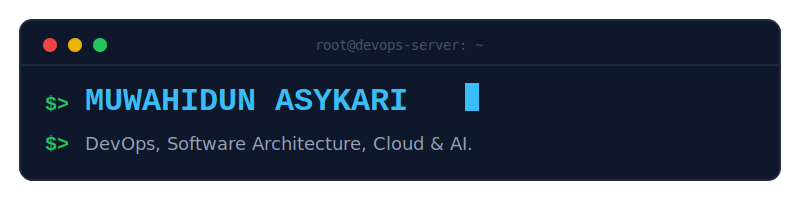

---

<!-- ABOUT -->
## `$ whoami`

Passionate about DevOps, cloud infrastructure, and automation.
Currently open to opportunities.

---

<!-- TECH STACK -->
## `$ cat tech-stack.txt`

**Cloud**

**Infrastructure as Code**

**Containers & Orchestration**

**CI/CD & GitOps**

**Observability & Monitoring**

**Networking & Security**

**Database**

**Version Control & Scripting**

---

<!-- CURRENTLY -->
## `$ tail -f activity.log`

| Status | Focus | Context |
|--------|-------|---------|
| 🔧 Working on | - | - |
| 📖 Learning | OpenTofu & OpenBao | Terraform Alternative |
| 🔭 Up next | - | - |

---

<!-- CONNECT -->
## `$ curl contact.json`

  
  &nbsp;
  
  &nbsp;

